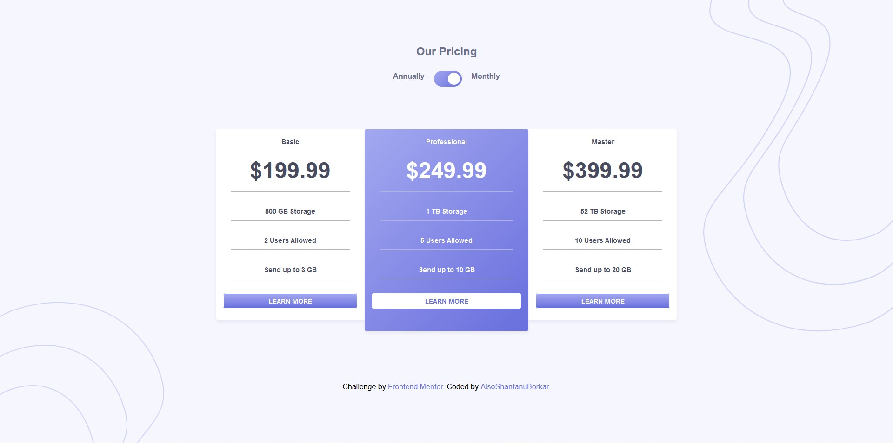

# Frontend Mentor - Pricing component with toggle solution

This is a solution to the [Pricing component with toggle challenge on Frontend Mentor](https://www.frontendmentor.io/challenges/pricing-component-with-toggle-8vPwRMIC). Frontend Mentor challenges help you improve your coding skills by building realistic projects. 

## Table of contents

- [Overview](#overview)
  - [The challenge](#the-challenge)
  - [Screenshot](#screenshot)
  - [Links](#links)
  - [Built with](#built-with)
  - [Useful resources](#useful-resources)
- [Author](#author)

## Overview

### The challenge

Users should be able to:

- View the optimal layout for the component depending on their device's screen size
- Control the toggle with both their mouse/trackpad and their keyboard
- **Bonus**: Complete the challenge with just HTML and CSS

### Screenshot

### Links

- Live Site URL: [Click Me](https://pricing-component-sb.netlify.app/)

### Built with

- Semantic HTML5 markup
- CSS custom properties
- Flexbox

### Useful resources

- [MDN Web Docs for CSS](https://developer.mozilla.org/en-US/docs/Web/CSS)
- [MDN Web Docs for JavaScript](https://developer.mozilla.org/en-US/docs/Web/JavaScript)

## Author

- Frontend Mentor - [@AlsoShantanuBorkar](https://www.frontendmentor.io/profile/AlsoShantanuBorkar)
- Github - [@AlsoShantanuBorkar](https://github.com/AlsoShantanuBorkar)

